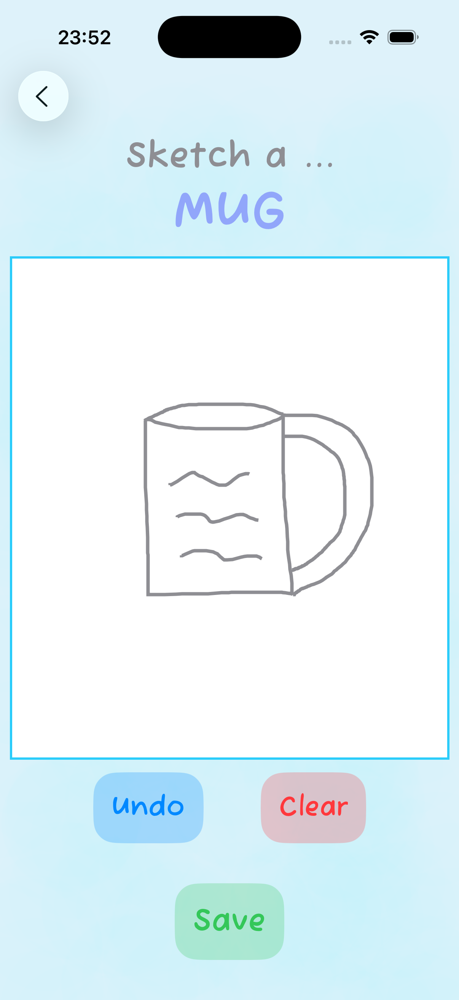
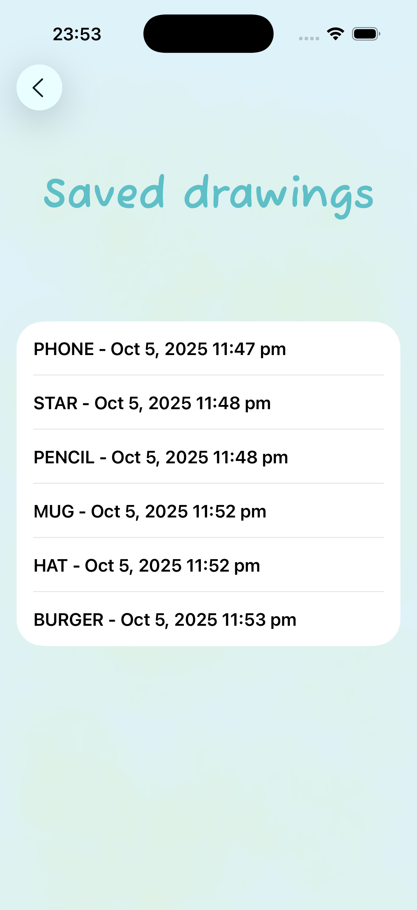

# Sketch It Out

This is a mobile application for iPhone. It is a sketching game that provides the user with a random object to draw then gives the user an option to save those drawings for later.

# Installation

1. Install XCode and Git
2. Open terminal and clone repo:
    ```bash
   git clone https://github.com/leonr678/SketchItOut.git
3. Open project in XCode

# Images




